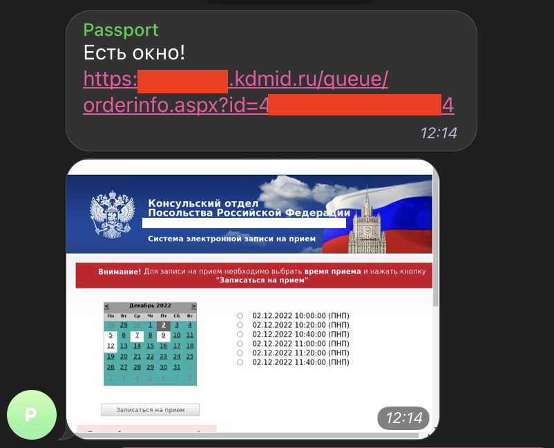
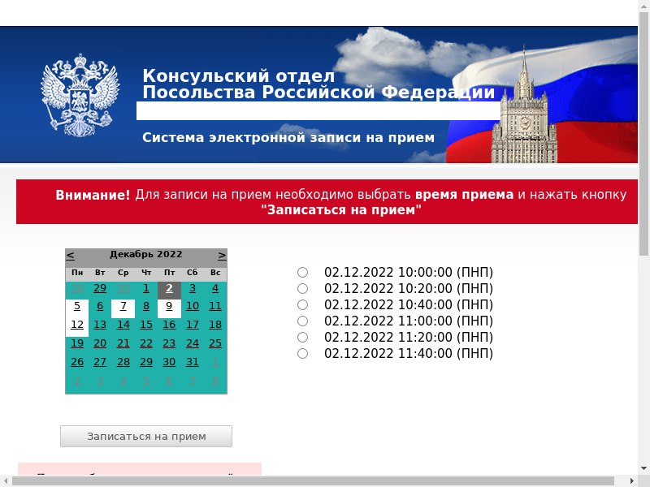

KDMID-бот
=====
Данный бот предназначен для автоматической записи в Консульский отдел РФ в любой стране, например, для получения Загранпаспорта.

Пример работы
---------
Вы отправляете боту ссылку на свою заявку (*https://...kdmid.ru/queue/queuechng.aspx?*), после чего бот начинает каждые 15 минут проверять наличие свободных окон. При их появлении он моментально отправляет вам сообщение в телеграме и присылает скриншот, где вы сразу увидите, какие слоты на текущий момент свободны, после чего сможете перейти по собственной ссылке и записаться. Данный бот проверен лично, осенью 2022 смог записать себя и знакомых в консульства Сербии, Боснии, Турции, ОАЭ и Египта. С другими странами будет работать аналогично. 

Доступ к боту
---------
Готов обсудить как продажу кода, так и платный доступ к боту - @bodichelli.
 
